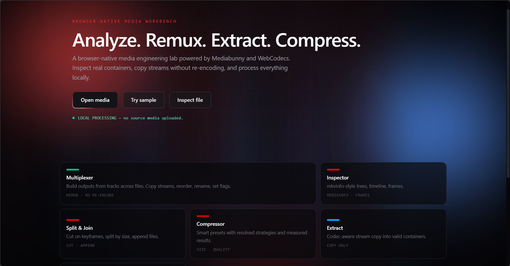

# BrowserFF

**Analyze. Remux. Extract. Compress.** A browser-native media engineering workbench powered by Mediabunny and WebCodecs.



No backend, no uploads. Drop a file and inspect real containers, copy streams without re-encoding, or transcode locally in the browser.

## Features

- **Multiplexer** — build outputs from tracks across files: reorder, rename, set language and flags (remux, no re-encode)
- **Inspector** — MediaInfo-style track trees, timeline, frame inspector, contact sheets
- **Split & Join** — keyframe-snapped splits, split by size, append files sequentially
- **Compressor** — smart presets with transparent strategies and measured results
- **Extract** — codec-aware stream copy into valid containers (never silently transcoded)
- **Analyzer** — why-is-this-file-large breakdowns, media reports, SHA-256 integrity
- Chapters, header editing, persistent job queue, lazy WASM codec extensions

## Quickstart

```bash
bun install
bun run dev
```

Open http://localhost:5173. Best in a Chromium-based browser (full WebCodecs support).

## Privacy

Local-first: media is processed in the browser and never uploaded. Optional Supabase sync stores metadata only — schema in `supabase/schema.sql`.

## Stack

React + Vite + TypeScript + Tailwind CSS · Mediabunny · IndexedDB · Supabase (optional)

## License

MIT
